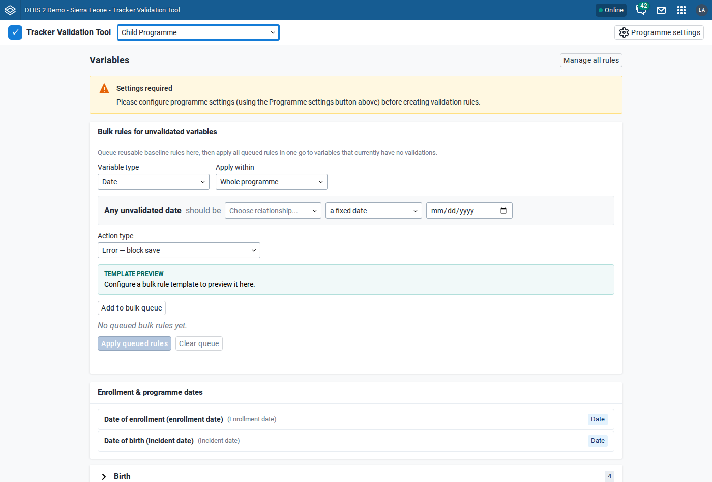
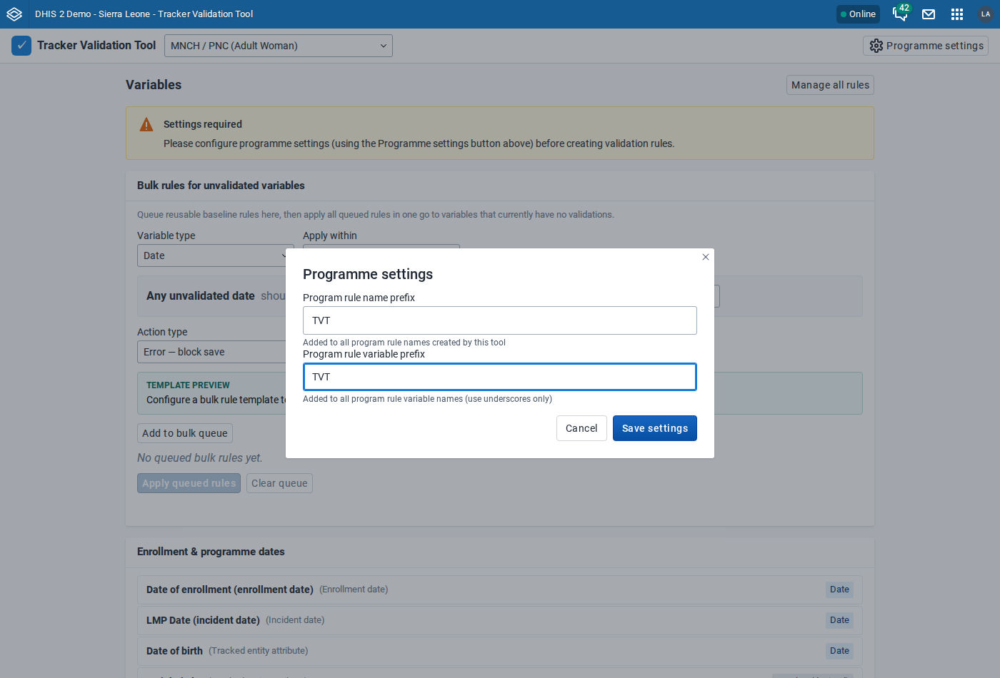
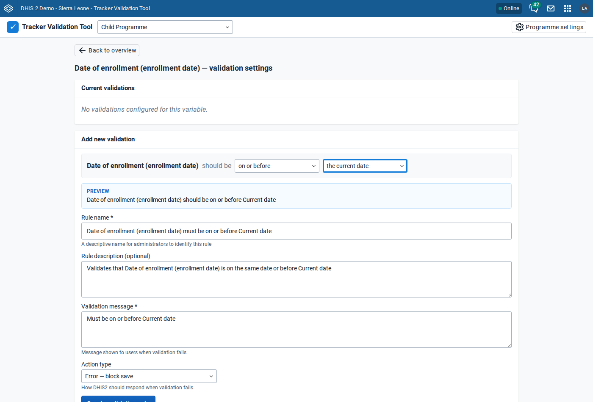
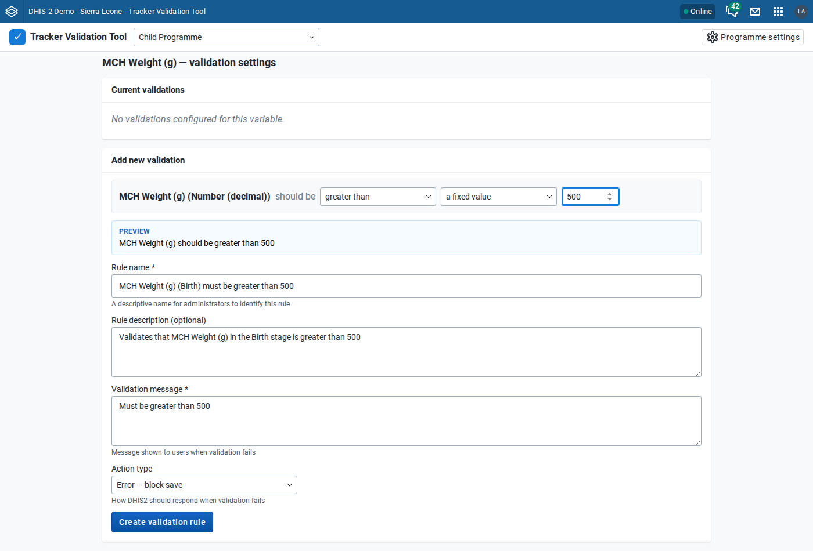
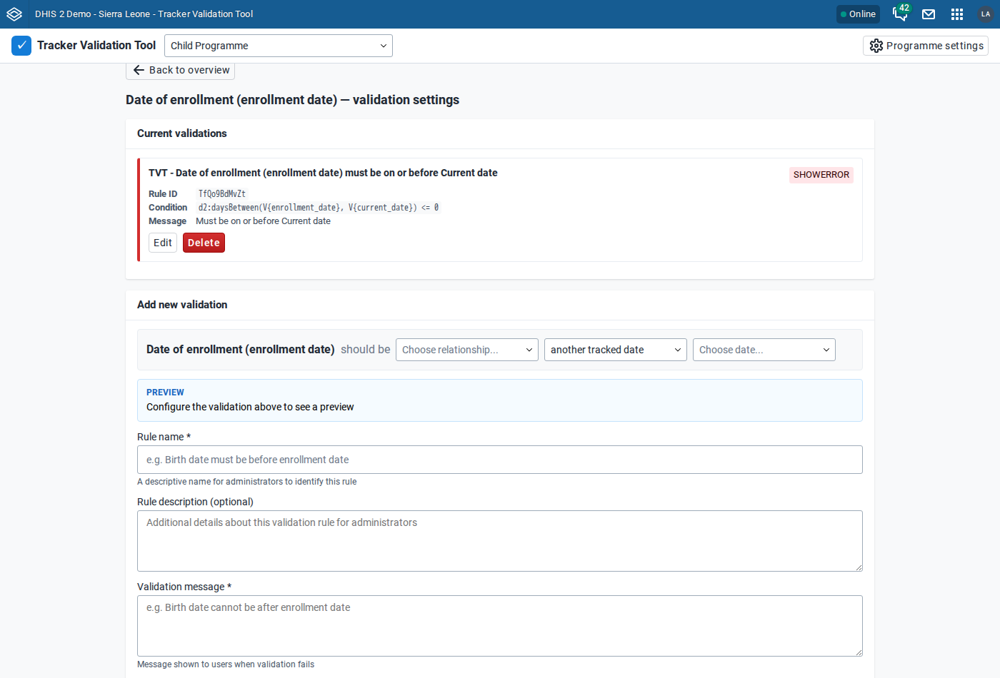
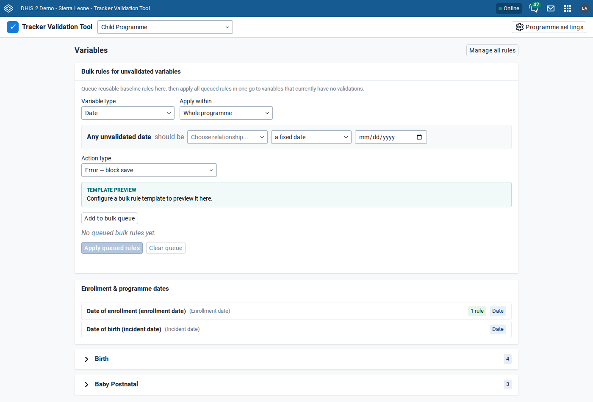
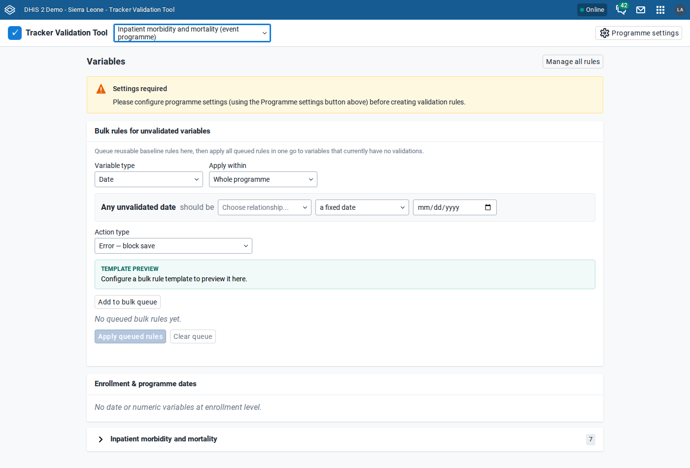
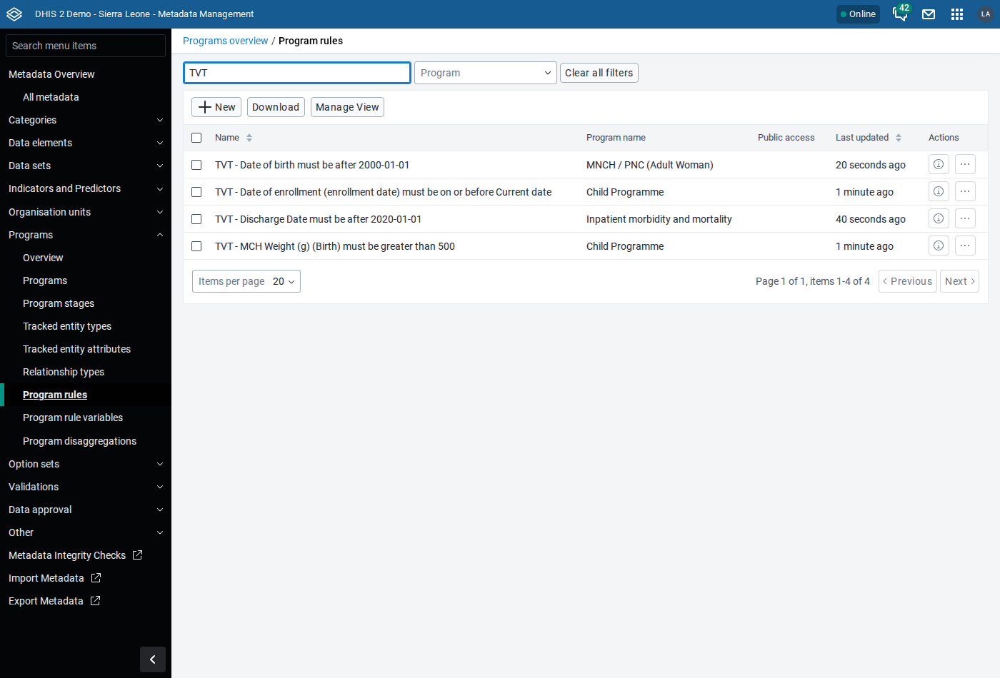
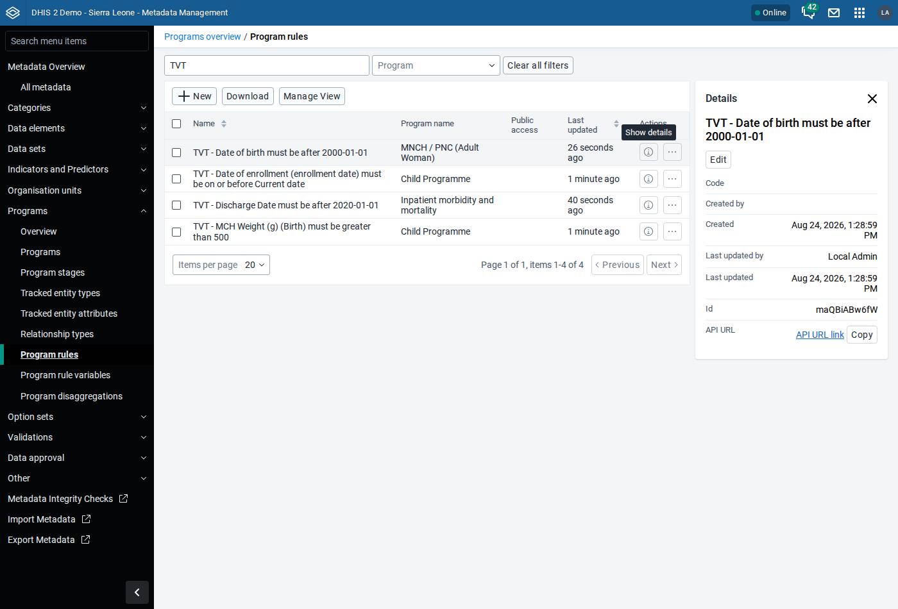
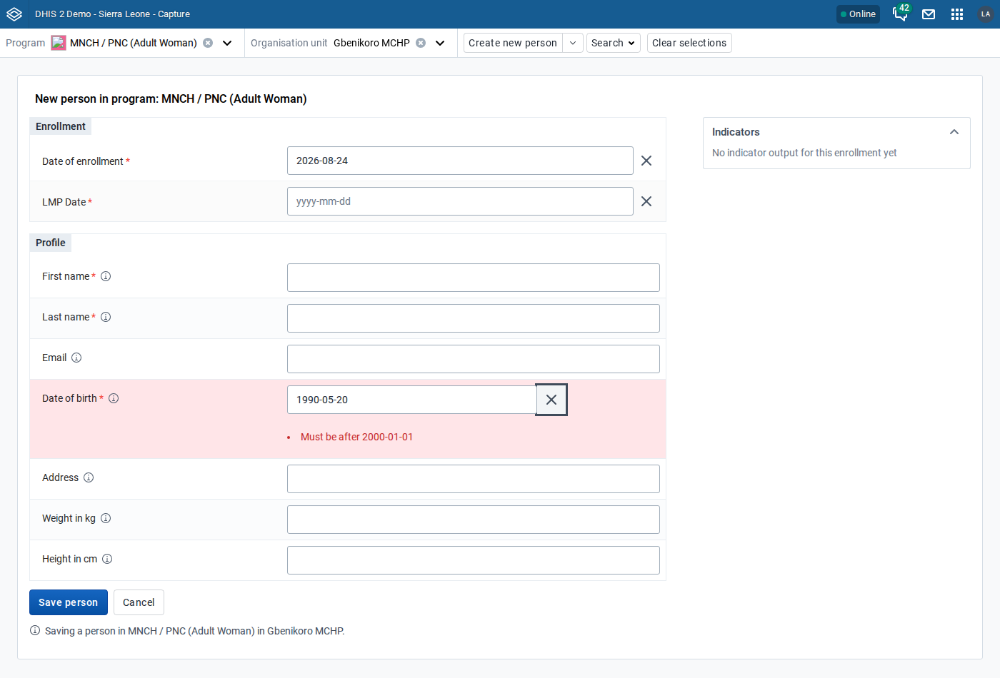

# Tracker Validation Tool — user manual

The Tracker Validation Tool creates and manages **DHIS2 program rules** that
check dates and numbers as data is entered. You describe the rule in plain
language — "date of birth must be after 2000-01-01" — and the tool writes the
program rule variable, the rule condition and the error message for you.

It works with **tracker programmes** and **event programmes**, on DHIS2
**2.41, 2.42 and 2.43**.

---

## 1. Pick a programme

Choose a programme in the header. Event programmes (programmes without
registration) are marked "(event programme)".

The overview lists every field the tool can validate, grouped into
**Enrollment & programme dates** and one section per programme stage. A tag on
the right shows each field's type and how many rules it already has.

## 2. Set the prefixes (once per programme)

Until this is done you'll see a **"Settings required"** warning and rule
creation is blocked. Open **Programme settings** and set two prefixes:

- a **rule prefix**, added to the name of every rule the tool creates
- a **variable prefix**, added to the program rule variables it creates

Prefixes make the tool's objects easy to find — and easy to tell apart from
program rules maintained by hand.

## 3. Create a rule

Click a field, then describe the rule in the sentence at the top of the form:
pick a relationship ("before", "after", "on or before", "between", "within"),
then what to compare against — another tracked date, a fixed date, the current
date, or an offset in days from the current date.

What each relationship accepts, for a field X compared with a date D (every
other value shows the rule's message):

| Relationship          | Accepted values                       |
| --------------------- | ------------------------------------- |
| X before D            | dates earlier than D                  |
| X on or before D      | D and earlier                         |
| X after D             | dates later than D                    |
| X on or after D       | D and later                           |
| X between L and U     | L to U, both included                 |
| X within N … before D | D minus N days/weeks/months/years … D |
| X within N … after D  | D … D plus N days/weeks/months/years  |

"Within" includes both ends and rejects dates on the other side of D: "within 7
days before 30 October" accepts 23 to 30 October only. Months and years are
calendar months (31 January plus one month is 28 February).

A rule never fires while one of the fields it compares is still empty.

Everything below the sentence is filled in for you and updates as you change
the rule:

- **Preview** — the rule in plain language
- **Rule name** — what administrators see in Metadata Management
- **Rule description** — a longer explanation, including the stage name when
  the programme has more than one stage
- **Validation message** — what the data-entry user sees
- **Action type** — error (blocks saving), warning (allows saving), or either
  of those only when the form is completed

You can edit any of the three texts. If you do, your wording is kept; if you
leave them alone, they stay in sync when you later change the rule's bound.

Numeric fields work the same way, with operators (greater than, less than,
between, …) instead of date relationships.

## 4. Review, edit, delete

The field's page lists its current rules with the generated DHIS2 condition,
the message, the action type and the rule's UID.

**Edit** reopens the rule. Change the bound and the name, description and
message follow along — unless you customised them, in which case your text is
preserved.

## 5. Apply a baseline to many fields at once

**Bulk rules for unvalidated variables** applies one rule template to every
field that has no rule yet — a fast way to set a sanity-check baseline such as
"no date before 1900-01-01" across a whole programme.

Choose the variable type and scope, describe the template, then **Add to bulk
queue**. Queue as many templates as you like and **Apply queued rules** to
create them all.

Two things to know:

- Bulk rules only ever touch fields with **no** rules, so they never overwrite
  something you configured deliberately.
- **Due dates are never included.** They are usually meant to be in the
  future (but not always), so no single template fits them; validate them
  one by one.
- Rules created this way are tagged, and when you later add a specific rule to
  one of those fields the tool offers to remove the now-redundant bulk rule.

## 6. Event programmes

Event programmes are supported and behave the same way, with two differences:
enrollment and incident dates are not offered (an event programme has no
enrollment the user ever sees), and rule names carry no stage suffix because
there is only one stage.

---

## What DHIS2 sees

Everything the tool creates is ordinary DHIS2 metadata. In the **Metadata
Management** app, under **Programs → Program rules**, filtering by your prefix
shows the rules with their generated names:

Selecting a rule and choosing **Show details** gives the usual metadata panel —
UID, created/updated, API link — and **Edit** opens DHIS2's own rule editor if
you ever need to go beyond what the tool exposes.

## What data-entry users see

In **Capture**, a value that breaks the rule is flagged against the field with
the validation message from step 3. Here "Date of birth must be after
2000-01-01" was configured, and `1990-05-20` was entered:

With the **Error — block save** action the record cannot be saved until the
value is fixed; with **Warning** it can. The two "on complete" action types
hold the message back until the user completes the form.

---

## Notes and limits

- **Relative bounds are in days.** Months and years are not offered: DHIS2
  accepts `d2:addMonths`/`d2:addYears` in a rule condition but does not
  evaluate them, so such a rule would silently never fire.
- **"Between" and "within" are inclusive** — a value equal to either end
  passes. A range that would reject every value (minimum above maximum, or a
  lower date bound after the upper one) cannot be saved.
- **Fields that already reject future dates.** If a field is configured with
  `allowFutureDate = false`, DHIS2 rejects a future value before any rule runs,
  so a "must be on or before today" rule adds nothing there. The tool warns
  when a rule you are writing contradicts the field's own setting.
- **Numeric fields bound to an option set** are not offered: the option set
  already limits the accepted values.
- **Rules on enrollment, incident, event and due dates are not shown on
  Android.** The DHIS2 Android Capture app (3.4.2) shows no message for them and
  lets the record be saved; DHIS2 then rejects it when the device syncs. Capture
  web shows them. Rules on data elements and attributes work on both.
- **On-complete actions on tracked entity attributes** are not supported by the
  DHIS2 Android app — it shows nothing. Prefer error/warning for attribute
  rules if Android is in use.
- Capture shows a field's **form name**, which can differ from the metadata
  name shown in this tool (for example "Discharge Date" versus "Date of
  discharge").
